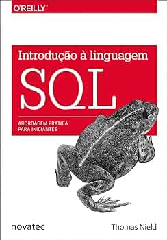

 
 
# Consultas SQL para Prática

Este repositório contém um conjunto de consultas SQL projetadas para ajudar você a melhorar suas habilidades em SQL. As consultas estão categorizadas em níveis por estrelas, cobrindo várias operações SQL, como joins, group by, subqueries e expressões de tabela comum (CTEs). Essas questões são do livro Introdução à linguagem SQL de Thomas Nield, peguei o banco de dados que ele disponibilizou no github dele, passei esse banco de dados para o gpt e pedi 25 questões.



## Índice

- [Introdução](#introdução)
- [Níveis de Dificuldade das Questões](#nivel-de-dificuldade)
- [★☆☆☆☆ 1 Estrela](#1-estrela)
- [★★☆☆☆ 2 Estrelas](#★★☆☆☆-2-Estrelas)
- [★★★☆☆ 3 Estrelas](#3-estrelas)
- [★★★★☆ 4 Estrelas](#4-estrelas)
- [★★★★★ 5 Estrelas](#5-estrelas)
- [Uso](#uso)
- [Contribuição](#contribuição)
- [Licença](#licença)

## Introdução

Este repositório inclui uma série de consultas SQL para um banco de dados de exemplo que inclui tabelas como `Artist`, `Album`, `Customer`, `Employee`, `Genre`, `Invoice`, `InvoiceLine`, `MediaType`, `Playlist`, `PlaylistTrack` e `Track`.

## Nivel de Dificuldade
As consultas estão divididas em 5 níveis:
- ★☆☆☆☆ 1 Estrela
- ★★☆☆☆ 2 Estrelas
- ★★★☆☆ 3 Estrelas
- ★★★★☆ 4 Estrelas
- ★★★★★ 5 Estrelas
## ★☆☆☆☆ 1 Estrela

1. **Listar os nomes dos álbuns e os nomes dos artistas correspondentes.**
   - [consulta1.txt](queries/consulta1.txt)

2. **Mostrar o total de vendas (soma de Total) por país.**
   - [consulta2.txt](queries/consulta2.txt)

3. **Encontrar todos os funcionários que reportam ao gerente com EmployeeId = 1.**
   - [consulta3.txt](queries/consulta3.txt)

4. **Listar o nome e a quantidade de faixas de cada playlist.**
   - [consulta4.txt](queries/consulta4.txt)

5. **Mostrar o nome dos clientes e a cidade onde moram.**
   - [consulta5.txt](queries/consulta5.txt)

## ★★☆☆☆ 2 Estrelas

1. **Listar o nome dos clientes e o total de suas compras, ordenado pelo valor total de compras em ordem decrescente.**
   - [consulta6.txt](queries/consulta6.txt)

2. **Encontrar o nome dos clientes que compraram mais de 5 produtos diferentes.**
   - [consulta7.txt](queries/consulta7.txt)

3. **Mostrar a quantidade de faixas (tracks) por gênero, apenas para gêneros que têm mais de 20 faixas.**
   - [consulta8.txt](queries/consulta8.txt)

4. **Encontrar os nomes das faixas (tracks) e os nomes dos compositores cujas faixas têm mais de 5 minutos (300000 milissegundos).**
   - [consulta9.txt](queries/consulta9.txt)

5. **Mostrar os nomes dos álbuns que possuem mais de 10 faixas (tracks).**
   - [consulta10.txt](queries/consulta10.txt)

## ★★★☆☆ 3 Estrelas

1. **Listar os álbuns onde a média das durações das faixas é superior a 5 minutos.**
   - [consulta11.txt](queries/consulta11.txt)
     
2. **Mostrar o cliente que fez a compra mais cara e o valor total dessa compra.**
   - [consulta12.txt](queries/consulta12.txt)
     
3. **Listar os compositores cujas faixas têm a maior média de duração e o valor dessa média.**
   - [consulta13.txt](queries/consulta13.txt)
     
4. **Encontrar o cliente que comprou a maior quantidade de faixas em um único pedido (invoice).**
   - [consulta14.txt](queries/consulta14.txt)
     
5. **Obter os Clientes que compraram acima da média de compra de todos os clientes.**
   - [consulta16.txt](queries/consulta16.txt)
     
## ★★★★☆ 4 Estrelas

1. **Obter o valor gasto em mês/ano.**
   - [consulta17.txt](queries/consulta17.txt)
     
2. **Obter o TM por Ano.**
   - [consulta18.txt](queries/consulta18.txt)
     
3. **Obter os Gêneros mais vendidos por Ano.**
   - [consulta19.txt](queries/consulta19.txt)
     
4. **Obter os Gêneros mais vendidos por País.**
   - [consulta20.txt](queries/consulta20.txt)
     
5. **Qual a frequência dos clientes?**
   -  [consulta25.txt](queries/consulta25.txt)

## ★★★★★ 5 Estrelas

1. **Calcular a Receita Média por Gênero de Música.**
   -  [consulta21.txt](queries/consulta21.txt)
     
2. **Encontrar o Cliente com o Maior Valor Total de Compras em Cada Ano.**
   -  [consulta22.txt](queries/consulta22.txt)
     
3. **Determinar as Faixas (Tracks) que Nunca Foram Vendidas.**
   -  [consulta23.txt](queries/consulta23.txt)
     
4. **Encontrar os Clientes que Não Fizeram Compras no Último Ano (2013).**
   - [consulta24.txt](queries/consulta24.txt)
     
5. **Listar os nomes dos clientes que compraram todas as faixas de um álbum específico.**
   - [consulta15.txt](queries/consulta15.txt)
     
## Uso

1. Clone o repositório:
    ```sh
    git clone https://github.com/seuusuario/consultas-sql-pratica.git
    ```
2. Navegue até o diretório do repositório:
    ```sh
    cd consultas-sql-pratica
    ```
3. Abra seu editor SQL preferido e execute as consultas nos arquivos .txt contra seu banco de dados.

## Contribuição

Contribuições são bem-vindas! Se você tiver sugestões ou melhorias, sinta-se à vontade para abrir uma issue ou enviar um pull request.

## Licença

Este projeto está licenciado sob a Licença MIT - veja o arquivo [LICENSE](LICENSE) para detalhes.
